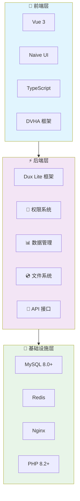

<h1 align="center">Dux PHP Admin</h1>

<p align="center">
  <strong>🚀 前后端不分离的 PHP 解决方案</strong>
</p>

<p align="center">
  基于 dux-lite 和 DVHA 的企业级管理系统开发框架
</p>

<p align="center">
  <a href="https://duxweb.github.io/dux-php-admin-docs/" target="_blank">📖 中文文档</a> |
  <a href="https://github.com/duxweb/dux-php-admin" target="_blank">🏠 GitHub</a> |
  <a href="https://www.dux.cn" target="_blank">🌐 官网</a>
</p>

<p align="center">
  
  
  
  
</p>

---

## ✨ 核心特性

* 🚀 **开箱即用** - 集成用户管理、权限控制、数据管理等核心功能，无需从零开始搭建
* ⚡ **运行时编译** - 修改 Vue 文件后刷新页面即可看到效果，无需 webpack、vite 等前端工具链
* 🎯 **前后端一体化** - Vue 文件和 PHP 代码放在一起，就像传统 PHP 开发一样简单直观
* 🔐 **完整权限系统** - 用户管理、角色管理、部门管理、菜单管理，细粒度权限控制
* 📊 **动态数据管理** - 可视化表单设计器、动态表格配置、自动生成 RESTful API
* 🎨 **现代化技术栈** - PHP 8.2+ + Vue 3 + Naive UI + TypeScript，享受最新技术带来的开发体验
* 🌐 **国际化支持** - 完整的多语言解决方案，支持自定义语言包和时区配置
* 🛠️ **丰富的功能** - 文件管理、日志系统、缓存系统、API 文档等完整的后台管理功能

## 🏗️ 架构设计



## 📦 核心功能

| 功能模块 | 功能描述 | 特点 |
|---------|---------|---------|
| 👥 **用户管理** | 用户注册、登录、个人信息管理 | 支持多种登录方式 |
| 🔐 **权限系统** | 角色权限、菜单权限、数据权限 | 细粒度权限控制 |
| 🏢 **部门管理** | 组织架构、部门层级管理 | 树形结构管理 |
| 📊 **数据管理** | 动态表单、数据表格、数据统计 | 可视化配置 |
| 📁 **文件管理** | 文件上传、存储、预览、下载 | 支持多种存储方式 |
| 📝 **日志系统** | 操作日志、系统日志、错误日志 | 完整的审计追踪 |
| ⚙️ **系统配置** | 系统参数、邮件配置、存储配置 | 动态配置管理 |
| 🌐 **多语言** | 界面多语言、数据多语言 | 国际化支持 |

## 🚀 快速开始

### 环境要求

- **PHP**: 8.2 或更高版本
- **扩展**: PDO、JSON、OpenSSL、Fileinfo、Mbstring
- **数据库**: MySQL 5.7+、SQLite 3.8+
- **Web服务器**: Nginx（推荐）、Apache

### 安装

#### 使用 Composer 创建项目

```bash
# 创建新项目
composer create-project duxweb/dux-php-admin my-project

# 进入项目目录
cd my-project

# 配置环境变量
cp .env.example .env

# 安装依赖并初始化
composer install
php dux install
```

### 启动开发服务器

```bash
# 启动开发服务器
php dux serve

# 访问 http://localhost:8000
# 默认管理员账号：admin / 123456
```

## 💻 使用示例

### 创建第一个 API

```php
<?php
// app/Demo/Api/Hello.php
namespace App\Demo\Api;

use Core\Attribute\RouteGroup;
use Core\Attribute\Route;
use Psr\Http\Message\ServerRequestInterface;
use Psr\Http\Message\ResponseInterface;

#[RouteGroup(app: 'api', route: '/hello')]
class Hello
{
    #[Route(methods: 'GET', route: '')]
    public function index(ServerRequestInterface $request, ResponseInterface $response): ResponseInterface
    {
        return send($response, '获取成功', ['message' => 'Hello Dux PHP Admin!']);
    }

    #[Route(methods: 'POST', route: '')]
    public function create(ServerRequestInterface $request, ResponseInterface $response): ResponseInterface
    {
        $data = Validator::parser($request->getParsedBody(), [
            "name" => ["required", '姓名不能为空'],
            "email" => ["required", "email", '邮箱格式不正确'],
        ]);

        return send($response, '创建成功', $data->toArray());
    }
}
```

### 创建管理页面

```vue
<!-- app/Demo/Admin/User.vue -->
<script setup lang="ts">
import { onMounted, ref } from 'vue'

const columns = [
  { key: 'id', title: 'ID', width: 80 },
  { key: 'name', title: '姓名' },
  { key: 'email', title: '邮箱' },
  { key: 'created_at', title: '创建时间' }
]

const data = ref([])
const loading = ref(false)

async function loadData() {
  loading.value = true
  try {
    const response = await fetch('/api/users')
    data.value = await response.json()
  }
  finally {
    loading.value = false
  }
}

onMounted(() => {
  loadData()
})
</script>

<template>
  <DuxPage>
    <DuxPageHeader title="用户管理" />
    <DuxPageBody>
      <DuxTable
        :columns="columns"
        :data="data"
        :loading="loading"
        @refresh="loadData"
      />
    </DuxPageBody>
  </DuxPage>
</template>
```

### 数据验证

```php
<?php
// 使用验证器验证数据
use Core\Validator\Validator;

$data = Validator::parser($request->getParsedBody(), [
    "name" => ["required", '姓名不能为空'],
    "email" => ["required", "email", '邮箱格式不正确'],
    "age" => ["required", "integer", "min", 18, '年龄必须大于18岁'],
    "password" => ["required", "lengthMin", 6, '密码至少6位'],
]);

// 验证通过后使用数据
$user = User::create($data->toArray());
```

### 权限控制

```php
<?php
// 在控制器中检查权限
use Core\Attribute\Permission;

#[RouteGroup(app: 'admin', route: '/users')]
class UserController
{
    #[Route(methods: 'GET', route: '')]
    #[Permission('user.index')]
    public function index(): ResponseInterface
    {
        // 只有拥有 user.index 权限的用户才能访问
        $users = User::paginate(15);
        return send($response, '获取成功', $users);
    }

    #[Route(methods: 'POST', route: '')]
    #[Permission('user.create')]
    public function store(): ResponseInterface
    {
        // 只有拥有 user.create 权限的用户才能创建
        // ...
    }
}
```

## 🔧 CLI 工具

Dux PHP Admin 提供了强大的命令行工具来提升开发效率：

```bash
# 查看所有可用命令
php dux

# 项目初始化
php dux install          # 初始化项目
php dux serve            # 启动开发服务器

# 数据库相关命令
php dux db:sync          # 同步数据库结构
php dux db:backup        # 备份数据库
php dux db:restore       # 恢复数据库

# 权限管理命令
php dux permission:sync  # 同步权限数据

# 缓存管理命令
php dux cache:clear      # 清理缓存

# 路由管理命令
php dux route:list       # 查看所有路由
```

## 🚀 部署指南

### 本地开发环境

推荐使用 [FlyEnv](https://flyenv.com/) 作为本地开发环境：

1. 下载并安装 FlyEnv
2. 启动 Nginx 和 MySQL 服务
3. 配置虚拟主机指向项目 `public` 目录

### 生产环境部署

#### Docker 部署（推荐）

```yaml
# docker-compose.yml
version: '3.8'
services:
  app:
    build: .
    ports:
      - '80:80'
    volumes:
      - ./data:/var/www/html/data
    environment:
      - APP_ENV=production
    depends_on:
      - db
      - redis

  db:
    image: mysql:8.0
    environment:
      MYSQL_ROOT_PASSWORD: ${DB_PASSWORD}
      MYSQL_DATABASE: ${DB_NAME}
    volumes:
      - mysql_data:/var/lib/mysql

  redis:
    image: redis:7-alpine
    volumes:
      - redis_data:/data

volumes:
  mysql_data:
  redis_data:
```

#### 宝塔面板部署

1. 安装宝塔面板：访问 [https://www.bt.cn/](https://www.bt.cn/) 获取最新安装脚本
2. 安装 LNMP 环境（Nginx + MySQL + PHP 8.2+）
3. 创建网站，设置运行目录为 `public`
4. 配置 Nginx 伪静态规则

详细部署说明请参考：[部署指南](https://duxweb.github.io/dux-php-admin-docs/guide/deployment.html)

## 📚 学习资源

### 📖 官方文档

- **[完整文档](https://duxweb.github.io/dux-php-admin-docs/)** - 详细的使用指南和开发文档
- **[快速入门](https://duxweb.github.io/dux-php-admin-docs/guide/getting-started.html)** - 5分钟上手指南
- **[系统概览](https://duxweb.github.io/dux-php-admin-docs/guide/system-overview.html)** - 了解系统功能
- **[开发指南](https://duxweb.github.io/dux-php-admin-docs/dev/quick-start/installation.html)** - 开发文档
- **[最佳实践](https://duxweb.github.io/dux-php-admin-docs/dev/best-practices/coding-standards.html)** - 开发最佳实践

### 🎯 相关项目

| 项目名称 | 描述 | 链接 |
|---------|------|------|
| **Dux Lite** | 轻量级 PHP 框架 | [GitHub](https://github.com/duxweb/dux-lite) |
| **DVHA** | Vue 3 管理系统框架 | [文档](https://duxweb.github.io/dvha/) |
| **DVHA Pro** | 专业版管理系统组件 | [文档](https://duxweb.github.io/dvha/pro/) |

## 🤝 参与贡献

我们欢迎所有形式的贡献！请查看 [贡献指南](CONTRIBUTING.md) 了解如何开始。

### 贡献方式

1. Fork 本仓库
2. 创建特性分支 (`git checkout -b feature/AmazingFeature`)
3. 提交更改 (`git commit -m 'Add some AmazingFeature'`)
4. 推送到分支 (`git push origin feature/AmazingFeature`)
5. 创建 Pull Request

### 贡献要求

在提交代码前，请确保：
- 代码符合 PSR-12 编码规范
- 添加了必要的测试用例
- 更新了相关文档
- 通过了所有测试

## 📊 项目数据

### 🌟 Star 趋势

[](https://star-history.com/#duxweb/dux-php-admin&Date)

### 💻 贡献者

感谢所有为 DuxLite 做出贡献的开发者们！

[](https://github.com/duxweb/dux-php-admin/graphs/contributors)

### 其他联系方式

- 📧 **邮箱**: admin@dux.cn
- 🌐 **官网**: [https://www.dux.cn](https://www.dux.cn)
- 🐛 **问题反馈**: [GitHub Issues](https://github.com/duxweb/dux-php-admin/issues)
- 💡 **功能建议**: [GitHub Discussions](https://github.com/duxweb/dux-php-admin/discussions)

## 📄 开源协议

本项目基于 [MIT](LICENSE) 协议开源，您可以自由使用、修改和分发。

## 👥 作者

**DuxWeb 团队**

- 🌐 官网: [https://www.dux.cn](https://www.dux.cn)
- 📧 邮箱: admin@dux.cn
- 🐙 GitHub: [@duxweb](https://github.com/duxweb)

## ⭐ 支持项目

如果这个项目对您有帮助，请给我们一个 ⭐️！

您的支持是我们持续改进的动力。

---

<p align="center">
  <strong>🎉 感谢使用 Dux PHP Admin！</strong>
</p>

<p align="center">
  <a href="https://duxweb.github.io/dux-php-admin-docs/">📖 文档</a> •
  <a href="https://github.com/duxweb/dux-php-admin/issues">🐛 报告问题</a> •
  <a href="https://github.com/duxweb/dux-php-admin/discussions">💡 功能建议</a>
</p>
